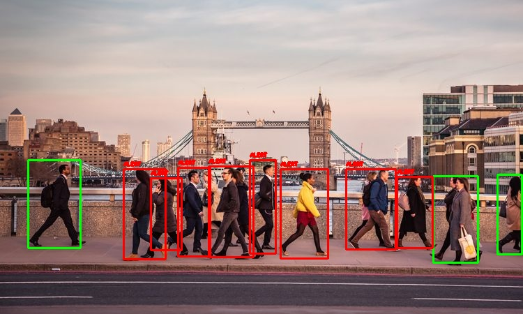

# Covid-19 Alert System
## Potential
It is able to detect people when they are close and send alert warning by making the box red.

## Requirements
1. Numpy
2. OpenCV
   
   Download the yolov3 model weight by clicking ["here"](https://pjreddie.com/media/files/yolov3.weights)  
   To run the algorithm for image Alert system `python3 image_test.py`
   and for video `python3 test_video.py` 
## Articles
To know more about yolov3 model click ["here"](https://towardsdatascience.com/yolo-v3-object-detection-53fb7d3bfe6b "yolov3")   
Before trying this project you can aways refer to ["object_detection"](https://machinelearningmastery.com/how-to-perform-object-detection-with-yolov3-in-keras/ "object_detecton_model") project